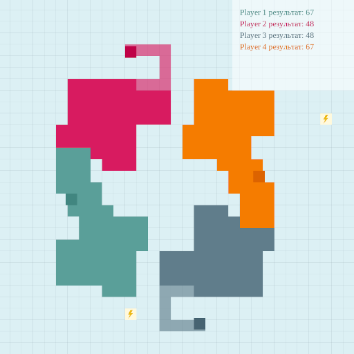

В данной задаче мы предлагаем вам написать бота для игры PaperIO.

Раннер игры написан на Python 3, поэтому для запуска игры вам понадобятся:

* Интерпретатор Python 3. Во всех дистрибутивах Linux он есть по умолчанию, на других платформах вам, возможно, придётся его поставить.
* Библиотеки pyglet и networkx:
  * На Ubuntu 23.04 они ставятся командой `sudo apt intstall python3-pyglet python3-networkx`.
  * На других платформах, включая более ранние версии Ubuntu, лучше ставить через `pip`: `pip3 install -r ./tools/runner/requirements.txt`.

Перед тем, как читать дальше, попробуйте сами сыграть в игру, вызвав `make play_keyboard`.
Вы играете за зелёный квадратик в левом нижнем углу, управление стрелками.

## 1. Правила игры

Задача сделана по мотивам проходившего в 2019 году соревнования AiCups 4, полную версию правил можно посмотреть в [репозитории соревнования](https://github.com/MailRuChamps/miniaicups/tree/master/paperio#1-%D0%BE%D0%BF%D0%B8%D1%81%D0%B0%D0%BD%D0%B8%D0%B5-%D0%BC%D0%B5%D1%85%D0%B0%D0%BD%D0%B8%D0%BA%D0%B8).

Краткий пересказ:
* Игровое поле имеет размер 930х930 пикселей.
* Одна игровая ячейка имеет размер 30х30 пикселей, т.е. всё поле - 31х31 ячеек.
* Каждый из игроков - это квадрат размером с ячейку. Находясь в центре ячейки, игрок может принимать решение, в какую сторону двигаться дальше. При этом нельзя двигаться в направлении, диаметрально противоположном тому, куда игрок двигался на прошлом ходу.
* Перемещаясь вне своей территории, игрок оставляет за собой шлейф. Пересечение шлейфа любым игроком ведёт к поражению того, чей шлейф пересекается.
* Выйдя за пределы своей территории и вернувшись на неё, игрок захватывает территорию, которую очерчивает его шлейф.
* За захватываемую территорию начисляются очки. За каждую захваченную нейтральную ячейку начисляется 1 очко, за ячейку другого игрока - 5 очков.
* Игра продолжается фиксированное количество тиков. Выигрывает игрок, у которого на момент конца игры наибольшее количество очков.

Ваша задача - написать бота, который сможет победить трёх встроенных противников 3 раза подряд.

## 2. Реализация

Вам нужно дописать код в файл `src/strategy.rs`. Протокол взаимодействия со стратегией следующий:

* Ваша стратегия будет инстанциирована методом `Strategy::new()` один раз.
* На каждый игровой тик, когда стратегия должна принять решение, будет зваться метод `.on_tick`. В качестве аргумента в этот метод передаётся состояние игрового мира. Вам нужно вернуть направление, в котором стратегия желает двигать своего игрока.
* Направления имеют абсолютный смысл. Т.е., например, `Direction::Up` всегда задаёт направление в сторону увеличения y-координаты.

Описание игрового мира задаётся структурой `World` в файле `src/data.rs`. Заметьте, что все координаты в `World` задаются в пикселях (тип `Point`). Чтобы сконвертировать пиксель в координаты содержащей его ячейки, используйте метод `point.to_cell()`.

Представленные структуры данных реализуют набор методов, которые могут оказаться вам полезны:

* `world.me()` возвращает игрока, которым управляет стратегия.
* `world.iter_enemies()` возвращает итератор по противникам.
* `world.iter_cells()` возвращает итератор по всем клеткам поля.
* `direction.next(clockwise)` возвращает следующее направление по либо против часово стрелки.
* `direction.opposite()` возвращает диаметрально противоположное направление.
* `point.to_cell()` возвращает координаты клетки, содержащей данный пиксель.
* `cell.distance_to(other)` возвращает Манхэттенское расстояние между двумя клетками.
* `cell.direction_to(other)` возвращает направление в сторону другой клетки.
* `cell.iter_neighbors()` возвращает итератор по соседним клеткам, находящимся в пределах игрового поля.
* `cell.adjacent(direction)` возвращает соседнюю клетку в указанном направлении, если она находится в пределах игрового поля, иначе `None`.
* `cell.adjacent_unchecked(direction)` возвращает соседнюю клетку в указанном направлении.
* `cell.in_bounds()` возвращает `true`, если клетка находится в пределах игрового поля.

Вы не обязаны использовать все из перечисленных методов. Если хотите, вы также можете добавлять свои методы к этим структурам.

## 3. Стратегия

Противники, которых вам предстоит одолеть, довольно слабые. Сработает, например, следующий алгоритм:

1. Находясь на своей территории, переберите все возможные прямоугольники, у которых вы сейчас находитесь в углу и которые не выходят за границы игрового поля.
2. Оцените каждый такой прямоугольник. Формулу оценки можно взять такую:

	`rectangle_score = cells_score - danger^2`

    Здесь:
    * `cells_score` - кол-во очков, которое вам принесёт захватываемая этим прямоугольником территория.
    * `danger` - длина периметра прямоугольника минус текущее минимальное расстояние врага до ячейки периметра этого прямоугольника.

3. Запомните наилучший прямоугольник и сделайте шаг по его периметру. Помните, что вы не можете начать двигаться в направлении, диаметрально противоположном тому, в котором вы двигались на прошлом ходу.

4. Если на новом ходу вы снова оказались на своей территории, проделайте алгоритм снова. Если вы не на своей территории, продолжайте двигаться по периметру прямоугольника с прошлого хода.

Можно заметить, что предложенный выше алгоритм работает за O(N^4). Но поле маленькое, а Rust быстрый, так что тут не предлагается ничего оптимизироать :)

Вещи, которые можно дополнительно попробовать:

* Покрутите значения констант.
* Чтобы сделать стратегию более смелой, добавьте штраф прямоугольникам, которые не захватывают новую территорию.
* Чтобы сделать стратегию более агрессивной, добавьте в оценку бонус за пересечение чужого шлейфа.

Для вдохновения можете почитать пост с разбором топ-2 стратегии: [История второго места в Mini AI Cup 4: Paper IO](https://habr.com/ru/articles/466597/).

## 4. Запуск и отладка

**Важно:** ваша стратегия ничего не должна печатать в stdout, потому что он используется для взаимодействия с раннером. Если хотите добавить отладочный вывод, пишите в stderr макросом `eprintln!()`.

Чтобы запустить свою стратегию под отладчиком, проделайте следующее:

* В VS Code нажмите Ctrl+Shift+P, введите `Debug: Add configuration...` -> `LLDB`.
* Добавьте в открывшийся файл launch.json следующую конфигурацию:

```json
{
	"version": "0.2.0",
	"configurations": [
		{
			"type": "lldb",
			"request": "launch",
			"name": "Debug paperio-bot (port 8000)",
			"cargo": {
				"args": [
					"build",
					"--bin=paperio-bot",
					"--package=paperio"
				],
				"filter": {
					"name": "paperio-bot",
					"kind": "bin"
				}
			},
			"args": [
				"8000"
			],
			"cwd": "${workspaceFolder}"
		}
	]
}
```

* Запустите в терминале команду `make play_debug`. Должно появиться сообщение `Waiting for player 1 to connect (port 8000)...`
* Запустите созданную на предыдущем шаге конфигурацию отладки.

Другие доступные рецепты:

* `make play` - собирает стратегию в релизной сборке и запускает игру против трёх встроенных противников.
* `make play_nogui` - тоже самое, но без визуализации и поэтому быстрее.

Чтобы запустить тесты, проверяющие решение целиком, позовите команду `make` без аргументов.

## Бонус: запуск WASM-файлов

Вы могли заметить, что встроенные стратегии лежат в папке `bots/` как wasm-файлы. Вы тоже можете скомпилировать свою стратегию в wasm и поделиться ей с друзьями. Для этого:

1. Поставьте необходимые инструменты сборки: `rustup target add wasm32-wasi`
2. Соберите свою стратегию: `cargo build --release --target wasm32-wasi`
3. Артефакт сборки будет лежать по пути `target/wasm32-wasi/release/paperio-bot.wasm`

Как запустить скомилированную в wasm стратегию:

1. Положите wasm-файл в папку `bots/`
2. В любом из рецептов `make` вы можете заменить стратегию по умолчанию следующим образом: `make play PLAYER_TWO=paperio-bot.wasm`
3. В перечисленных выше рецептах за перевого игрока играет стратегия, собираемая из исходников, поэтому `PLAYER_ONE` переопределить не выйдет. Но вы можете использовать специальный рецепт `make play_wasm`, где первая стратегия тоже берётся из wasm-файла. В этом рецепте вам обязательно нужно указать переменную `PLAYER_ONE`.

Напомним, что по кодексу чести ШАД вы не можете делиться исходным кодом своего решения. Но wasm-файл не является исходным кодом, так что скомпилированной в wasm стратегией можно делиться без проблем :)
